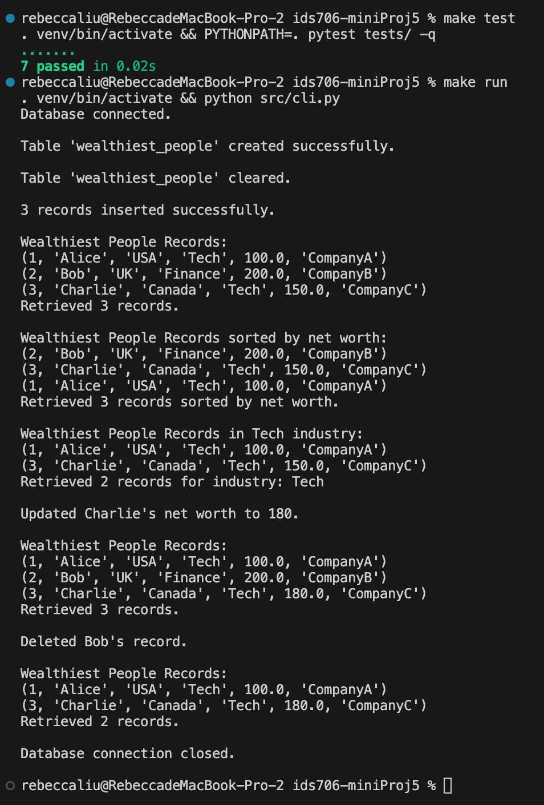

# IDS706 Python Script interacting with SQL Database

## Continuous Integration with GitHub Actions
[](https://github.com/Reby0217/ids706-miniProj6/actions/workflows/install.yml)
[](https://github.com/Reby0217/ids706-miniProj6/actions/workflows/lint.yml)
[](https://github.com/Reby0217/ids706-miniProj6/actions/workflows/format.yml)
[](https://github.com/Reby0217/ids706-miniProj6/actions/workflows/test.yml)


This project focuses on interacting with a SQL database using Python. It performs CRUD operations on a database containing information about the wealthiest people.

---
## Deliverables
- **Python script**: The main script `cli.py` handles database interactions.
- **Screenshot of successful database operations**: 



## Project Structure
```bash
.
├── src
│   ├── cli.py                         # Script for interacting with the SQL database
├── tests
│   ├── test_script.py                 # Unit tests for CRUD operations
├── requirements.txt                   # Project dependencies
├── Makefile                           # Commands for install, setup, test, run, lint, and format
├── wealth_db.db                       # SQLite database
└── .github/workflows                  # CI/CD workflows for GitHub Actions
```

## Makefile

The project uses a `Makefile` to streamline development tasks, including testing, formatting, linting, and installing dependencies. Key Makefile commands:

- **Install**: Upgrade `pip` and install project dependencies.
  ```bash
  make install
  ```
  
- **Setup**: Create and activate a virtual environment, ensuring the latest version of `pip` is installed.
  ```bash
  make setup
  ```

- **Format**: Automatically format all Python files with `black`.
  ```bash
  make format
  ```

- **Lint**: Check code quality using `ruff`.
  ```bash
  make lint
  ```

- **Test**: Run the unit tests for the project.
  ```bash
  make test
  ```

- **Run**: Execute the main Python script to interact with the database.
  ```bash
  make run
  ```

- **All**: Run the full suite of tasks—install, setup, lint, test, and format.
  ```bash
  make all
  ```

## Getting Started

### Prerequisites

- Python 3.9+
- `pip` for managing dependencies

### Installation

1. Clone the repository:

   ```bash
   git clone https://github.com/Reby0217/ids706-indvidual1.git
   cd ids706-indvidual1
   ```

2. Install dependencies:

   ```bash
   make install
   ```
3. Create and activate a virtual environment:
   ```bash
   make setup
   ```

4. Run the Python script:
   ```bash
   make run
   ```

5. Run tests:
   ```bash
   make test
   ```

6. Format and lint the code:
   ```bash
   make format
   make lint
   ```

## Requirements

### Database Connection
The project establishes a persistent connection to an SQLite database (`wealth_db.db`) using the `sqlite3` module. The connection allows for all standard SQL operations:
```python
conn = sqlite3.connect("wealth_db.db")
```
- **Automatic table creation**: The table `wealthiest_people` is created if it does not already exist.

### CRUD Operations

- **Create**: New records for the wealthiest individuals are inserted into the database.
- **Read**: Data is retrieved from the database in multiple ways: all records, sorted by  `net_worth` or filtered by `industry`.
- **Update**: The net worth of specific individuals can be updated.
- **Delete**: Specific records can be deleted from the database.

1. **Create**:
   ```python
   cursor.executemany("INSERT INTO wealthiest_people (id, name, country, industry, net_worth, company) VALUES (?, ?, ?, ?, ?, ?)", people)
   ```
2. **Read**:
   - **All Records**:
     ```sql
     SELECT * FROM wealthiest_people
     ```
   - **Sort by Net Worth**:
     ```sql
     SELECT * FROM wealthiest_people ORDER BY net_worth DESC
     ```
   - **Filter by Industry**:
     ```sql
     SELECT * FROM wealthiest_people WHERE industry = ?
     ```
3. **Update**:
   ```python
   cursor.execute("UPDATE wealthiest_people SET net_worth = 180 WHERE name = 'Charlie'")
   ```
4. **Delete**:
   ```python
   cursor.execute("DELETE FROM wealthiest_people WHERE name = 'Bob'")
   ```


### 2 different SQL Queries
- **Sort by Net Worth**: The script retrieves the wealthiest people sorted by their net worth using the query:
  ```sql
  SELECT * FROM wealthiest_people ORDER BY net_worth DESC
  ```
- **Filter by Industry**: The script filters records based on the industry, e.g., retrieving all records from the "Tech" industry:
  ```sql
  SELECT * FROM wealthiest_people WHERE industry = ?
  ```