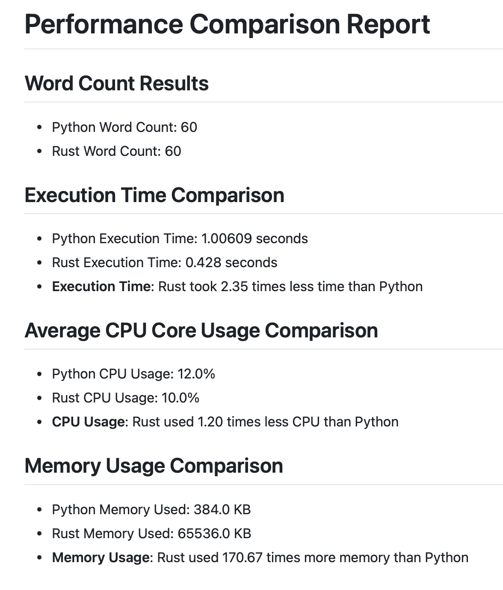

# IDS706 Rewrite a Python Script in Rust

## Continuous Integration with GitHub Actions
[](https://github.com/Reby0217/ids706-miniProj8/actions/workflows/install.yml)
[](https://github.com/Reby0217/ids706-miniProj8/actions/workflows/lint.yml)
[](https://github.com/Reby0217/ids706-miniProj8/actions/workflows/format.yml)
[](https://github.com/Reby0217/ids706-miniProj8/actions/workflows/test.yml)
[](https://github.com/Reby0217/ids706-miniProj8/actions/workflows/report.yml)


This project focuses on rewriting a Python script in Rust to create a more efficient command-line tool that counts words in a text file and stores the result in an SQL database. The emphasis is on demonstrating improvements in speed and resource usage through the Rust implementation. 

---

## Deliverables:

### Python Script: `word_counter_py/cli.py`

This script provides the following functionality:

- **count_words(filename)**: Reads a file and returns the number of words.
- **store_word_count(filename, word_count, conn)**: Stores the word count in the SQLite database.
- **main()**: Entry point of the script that takes a filename as input, counts the words, and stores the result in the database.

### Rust Script: `word_counter_rust/src/main.rs`

The Rust version of the script implements the same functionality as the Python script, aiming for better performance.


### Performance Comparison

A performance comparison report is auto-generated by GitHub Actions and pushed to the repository as `performance_report.md`, highlighting the differences between the Python and Rust implementations. Note that performance may vary with each run due to system resources. The screenshot below is for demonstration purposes; refer to the `performance_report.md` for the latest results.

  - **Screenshot of performance report**:
    

---

## Packaging with `setuptools`

We used `setuptools` to package this Python script into a command-line tool. Below is a demonstration that outlines how the project is packaged using a `setup.py` script.

### Key Features of the `setup.py` File:
- **Name and version**: The name of the package is `word_counter` and its version is dynamically read from a `VERSION` file.
- **Command-line tool**: The tool is accessible via the terminal with the `word_counter` command.
- **Dependencies**: All dependencies required to run this tool are specified in `requirements.txt`.
- **Entry point**: The tool is accessed by running `word_counter` through the command line, which points to the `main()` function in `word_counter_py/cli.py`.

---

## Guide of Package Usage

### Prerequisites

- Python 3.9+

### Installation

1. Clone the repository:

   ```bash
   git clone https://github.com/Reby0217/ids706-miniProj8.git
   cd ids706-miniProj8
   ```

2. Install dependencies:

   ```bash
   make install
   ```

3. Create and activate a virtual environment:
   ```bash
   make setup
   ```

4. Install the package using `setup.py`:
   ```bash
   make install-package
   ```

5. Install the Rust-based version:
   ```bash
   cd word_counter_rust
   cargo install --path .
   cd ..
   ```

6. Verify the package installation and check available options:
   ```bash
   word_counter --help
   ```

   

### Usage 

This tool not only counts the words in a file but also stores the result in an SQLite database for future reference. Here’s how to use it:

   ```bash
   word_counter <path_to_text_file>
   ```

For the Rust-based version:

   ```bash
   word_counter_rust <path_to_text_file>
   ```

### Example

1. For example, to count the words in `test.txt` using Python:

   ```bash
   word_counter test.txt
   ```

   The command will:
   - Count the words in `test.txt`.
   - Print the word count to the terminal.
   - Store the filename and word count in a local SQLite database (`word_counts.db`).

2. To count the words using the Rust-based version:

   ```bash
   word_counter_rust test.txt
   ```

   This command achieves the same results using a more efficient Rust implementation.
  


3. The results are stored in the `word_counts.db` SQLite database in a table called `word_counts`. You can inspect the database to see the stored values.

   - **Screenshot of the database table**:
   
      


---

### Makefile

The project uses a `Makefile` to streamline development tasks, including setting up the environment, testing, formatting, linting, and installing dependencies. Key Makefile commands:

- **Install**: Upgrade `pip` and install all the required project dependencies listed in `requirements.txt`.
  ```bash
  make install
  ```

- **Setup**: Create a Python virtual environment, activate it, and upgrade `pip` within the virtual environment.
  ```bash
  make setup
  ```

- **Format**: Automatically format all Python files using `black`.
  ```bash
  make format
  ```

- **Lint**: Check the code quality using `ruff` on both the `src` and `tests` directories.
  ```bash
  make lint
  ```

- **Test**: Run the unit tests in the `tests` directory using `pytest` within the virtual environment.
  ```bash
  make test
  ```

- **Run**: Execute the main Python script to count words in a file and store the result in the SQLite database.
  ```bash
  make run
  ```

- **Clean**: Remove the virtual environment to start fresh.
  ```bash
  make clean
  ```

- **Install Package**: Install the project package using `setup.py`.
  ```bash
  make install-package
  ```

- **Clean Package**: Remove all the package-related files generated by `setup.py`.
  ```bash
  make clean-package
  ```

- **All**: Run all major tasks in sequence: `install`, `setup`, `lint`, `test`, and `format`.
  ```bash
  make all
  ```
